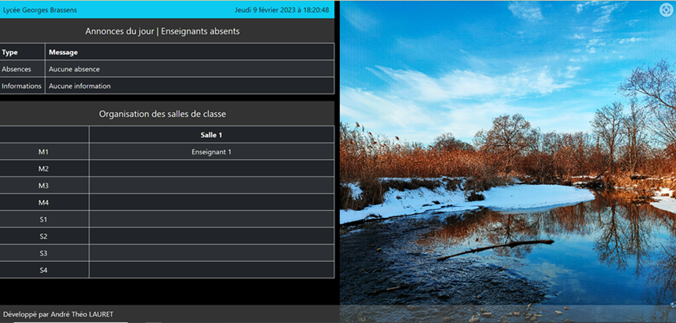

<!--
NOTA: Este README foi creado automáticamente por <https://github.com/YunoHost/apps/tree/master/tools/readme_generator>
NON debe editarse manualmente.
-->

# Scovie para YunoHost

[](https://dash.yunohost.org/appci/app/scovie)  

[](https://install-app.yunohost.org/?app=scovie)

*[Le este README en outros idiomas.](./ALL_README.md)*

> *Este paquete permíteche instalar Scovie de xeito rápido e doado nun servidor YunoHost.*  
> *Se non usas YunoHost, le a [documentación](https://yunohost.org/install) para saber como instalalo.*

## Vista xeral

[Scovie](https://github.com/eldertek/scovie) is an open-source digital signage system for high schools, built using Python and Django.
It provides an easy-to-use interface for administrators to upload and manage multimedia content, which is then displayed on screens throughout the school.

## Links

* Report a bug about this package: <https://github.com/eldertek/scovie/issues>
* PyPi package: <https://pypi.org/project/scovie/>


**Versión proporcionada:** 0.0.6~ynh2

**Demo:** <https://scovie.eclipse-technology.eu>

## Capturas de pantalla



## Documentación e recursos

- Repositorio de orixe do código: <https://github.com/eldertek/scovie>
- Tenda YunoHost: <https://apps.yunohost.org/app/scovie>
- Informar dun problema: <https://github.com/YunoHost-Apps/scovie_ynh/issues>

## Info de desenvolvemento

Envía a túa colaboración á [rama `testing`](https://github.com/YunoHost-Apps/scovie_ynh/tree/testing).

Para probar a rama `testing`, procede deste xeito:

```bash
sudo yunohost app install https://github.com/YunoHost-Apps/scovie_ynh/tree/testing --debug
ou
sudo yunohost app upgrade scovie -u https://github.com/YunoHost-Apps/scovie_ynh/tree/testing --debug
```

**Máis info sobre o empaquetado da app:** <https://yunohost.org/packaging_apps>
